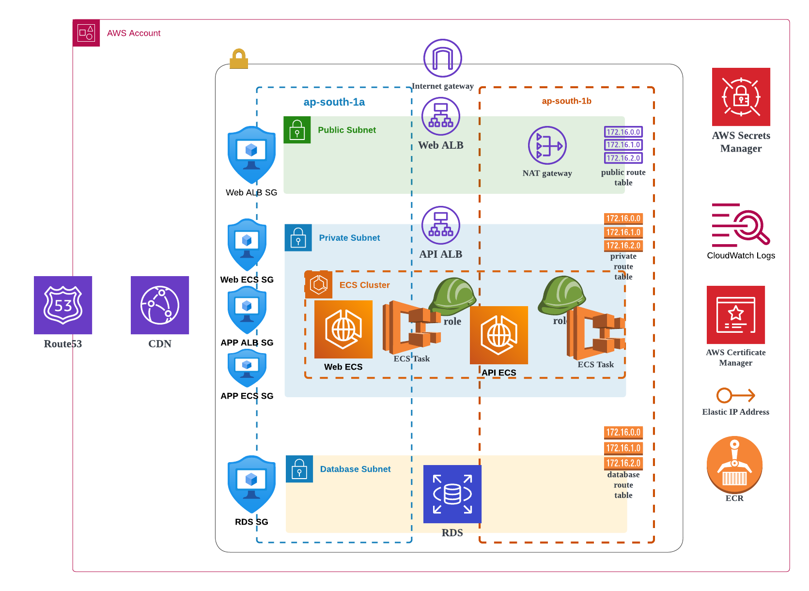
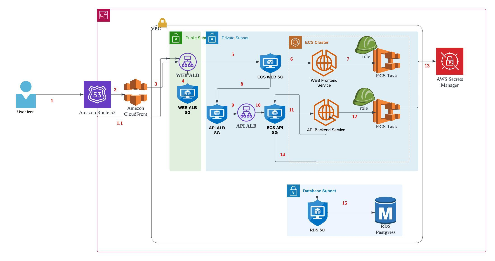

### Assignment

We are using the below services in this assignment.
#### Project Infra:
* VPC
    * We selected 2 AZ for HA.
    * We create a VPC.
    * We create 2 public subnets, private subnets, database subnets.
    * We create internet gateway and attach to VPC.
    * We create public route table, private route table, database route table and attach to respective subnets.
    * We create EIP and NAT Gateway.
    * We add respective routes to all route tables.
* SG
    * We create one SG to RDS.
    * We create one SG to API ALB.
    * We create one SG to Web ALB.
* RDS
    * We create RDS
    * We create RDS secret
* ACM
    * We create ACM for API ALB
    * We create ACM for Web ALB
    * We create ACM for CDN.
* ALB
    * We create API ALB.
    * We create Web ALB.
* Route53
    * We create one record for API ALB.
    * We create one record for Web ALB.
    * We create one record for CDN.
* ECS
    * We create one ECS Cluster
    * We create ECR repos for API and Web
    * We create CloudWatch log group.
* Parameters
    * We export all the necessary parameters to SSM parameter store.

#### Applications
 Below are things required by applications.

 #### API application
 * IAM
    * We create IAM task role and task execution role. These roles should have access to read secret and pull image from repos.
    * Respective IAM trust policy and permission polices will be created.
* SG
    * We create API ECS SG.
    * SG rules will be added to allow traffic only from API ALB.
    * SG rule to RDS SG will be added to allow traffic only from API ECS SG.
* ECS
    * We create task definition.
    * We create ECS Service.
    * We attach ECS Service to API ALB.
    * We create ECS CloudWatch Log group.

#### Web application
 * IAM
    * We create IAM task role and task execution role. These roles should have access to pull image from repos.
    * Respective IAM trust policy and permission polices will be created.
* SG
    * We create Web ECS SG.
    * SG rules will be added to allow traffic only from Web ALB.
    * SG rule to API ALB SG will be added to allow traffic only from ECS Web SG.
* ECS
    * We create task definition.
    * We create ECS Service.
    * We attach ECS Service to Web ALB.
    * We create ECS CloudWatch Log group.

Traffic flow is like below.

